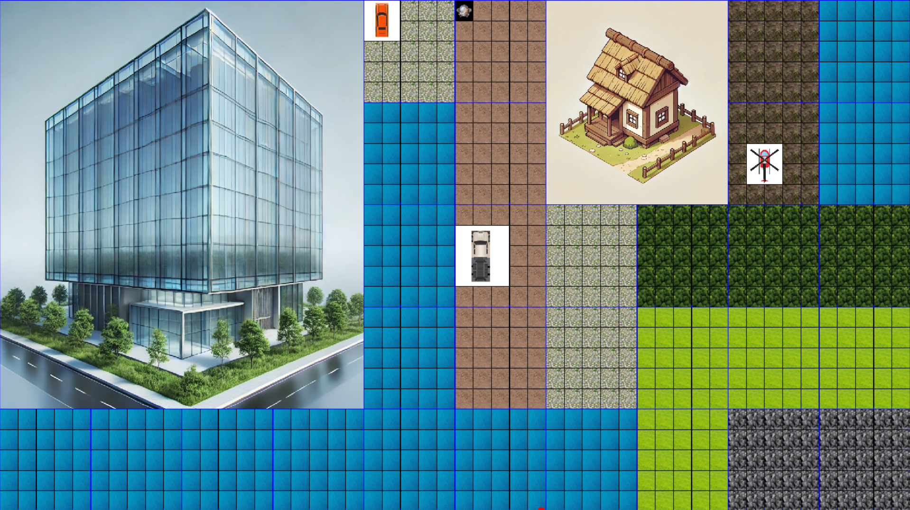

# ANNAK - C++ Game Project

ANNAK is a C++ game inspired by the mechanics of *Catan*, designed to deliver an engaging and dynamic strategy-based experience. The project leverages advanced object-oriented programming principles and algorithmic problem-solving to create a balanced and interactive game environment.

---
## Visual Representation

The following is an example of the game's visual interface:




##

---

## Features

### 1. **Object-Oriented Design**

- **Classes**: Comprehensive design of various classes to represent key game elements such as:
  - Players
  - Resources
  - Tiles
  - Game Board
  - Structures (roads, buildings, etc.)
- Each class encapsulates data and functionality to ensure scalability and maintainability.

### 2. **Advanced Algorithms**

- Algorithms developed to manage:
  - Resource allocation.
  - Player interactions and turn management.
  - Game state progression.
- Ensures dynamic gameplay that is both balanced and challenging.

### 3. **Interactive GUI**

- Built with **OpenCV**, the graphical interface allows players to:
  - Interact with the game board.
  - Receive real-time updates.
  - View visual representations of game states.

### 4. **Scalable and Maintainable Design**

- Implements advanced OOP principles to:
  - Simplify code management.
  - Ensure easy addition of new features.
  - Support potential multiplayer functionality in future iterations.

---

## Getting Started

### Prerequisites

- C++ Compiler (e.g., GCC, Clang, or MSVC).
- OpenCV library installed and configured for your development environment.
- Basic knowledge of C++ and OOP principles.

### Installation

1. Clone the repository:
   ```bash
   git clone https://github.com/RacheliBardenshtain/Catan-Game.git
   ```
2. Navigate to the project directory:
   ```bash
   cd annak
   ```
3. Compile the source code:
   ```bash
   g++ -o annak main.cpp -lopencv_core -lopencv_highgui -lopencv_imgproc
   ```
4. Run the executable:
   ```bash
   ./annak
   ```

---


## Future Enhancements

- Expand GUI functionality to include:
  - Drag-and-drop features for game elements.
  - Animated transitions and effects.
- Implement networked multiplayer support.
- Add AI players for single-player mode.

---

## Acknowledgments

This project was inspired by the strategic gameplay of *Catan* and was built as a demonstration of advanced programming concepts in C++.

